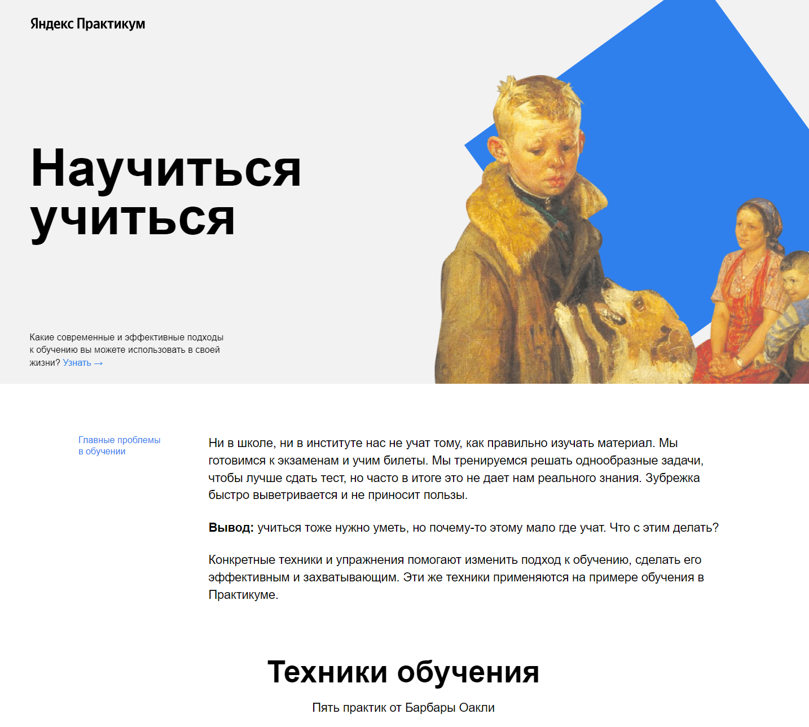

# Сайт “Научится учится”

#### Ссылка на сайт: [balzak1976.github.io/how-to-learn](https://balzak1976.github.io/how-to-learn/)

## Описание и функциональность проекта
Учебный проект по верстке одностраничного сайта “Научится учится”, выполненной на курсе “Веб-разработчик” яндекс практикума.

<br>

На сайте используется:
- технология флекс-бокс
- методология БЭМ (наименование классов и файловая структура CSS - Nested БЭМ)
- применяется анимация декоративных элементов и вставка видео с YouTube.


<div align="center">

### Главная страница

</div>




## Стэк технологий

| <a href="https://html.spec.whatwg.org/multipage/" target="_blank" rel="noreferrer"></a> | <a href="https://www.w3schools.com/css/" target="_blank" rel="noreferrer"></a> | <a href="http://getbem.com/" target="_blank"></a> |
| :---: | :---: | :---: |
| HTML | CSS  | BEM |

<br>


## Запуск проекта

клонировать репозиторий

```javascript
git clone https://github.com/Balzak1976/russian-travel.git
```
запустить index.html

<br>
